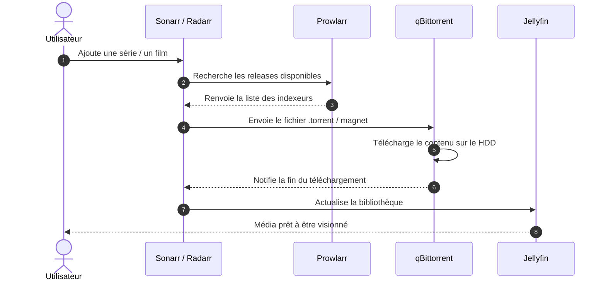

```mermaid
sequenceDiagram
    autonumber
    actor U as Utilisateur
    participant S as Sonarr / Radarr
    participant P as Prowlarr
    participant Q as qBittorrent
    participant J as Jellyfin

    U->>S: Ajoute une série / un film
    S->>P: Recherche les releases disponibles
    P-->>S: Renvoie la liste des indexeurs
    S->>Q: Envoie le fichier .torrent / magnet
    Q->>Q: Télécharge le contenu sur le HDD
    Q-->>S: Notifie la fin du téléchargement
    S->>J: Actualise la bibliothèque
    J-->>U: Média prêt à être visionné
```
